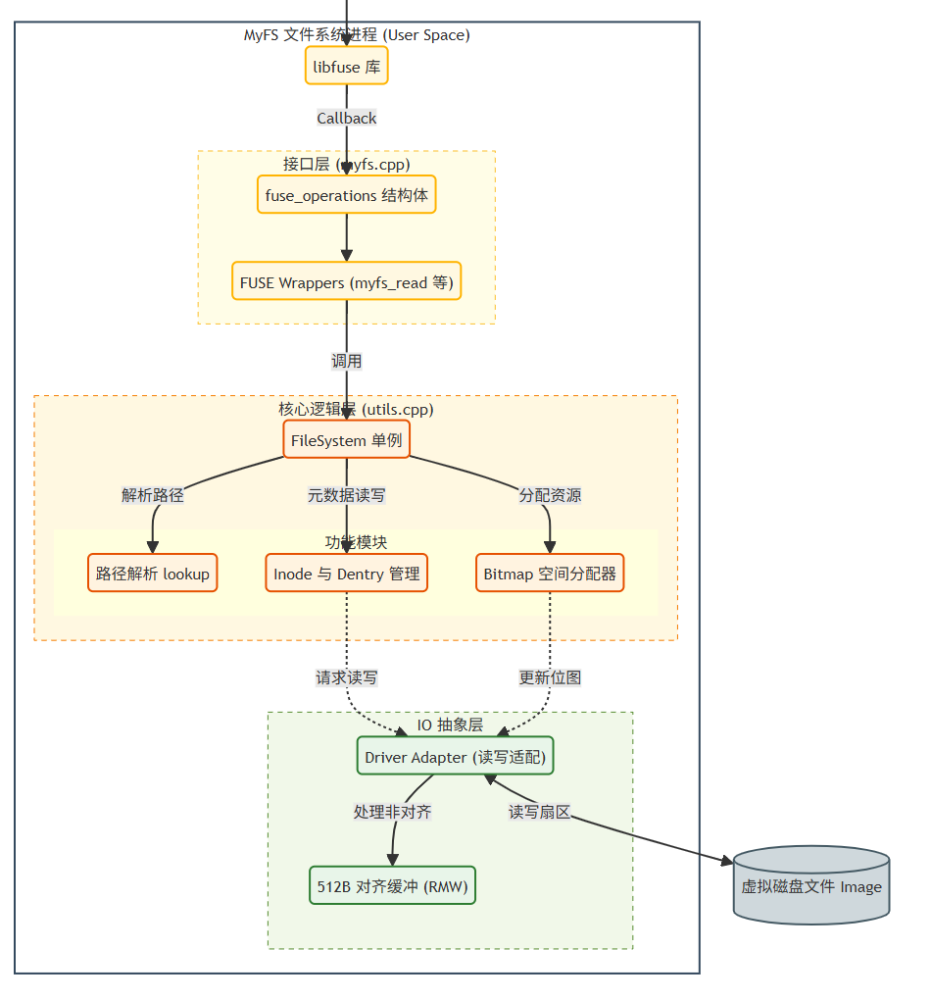
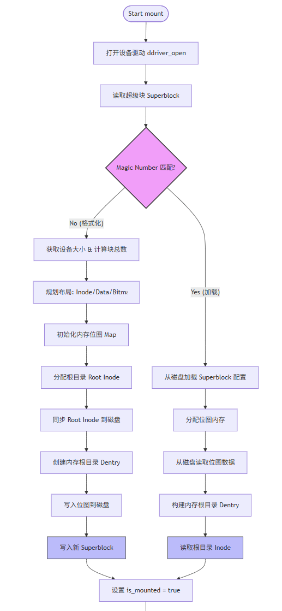
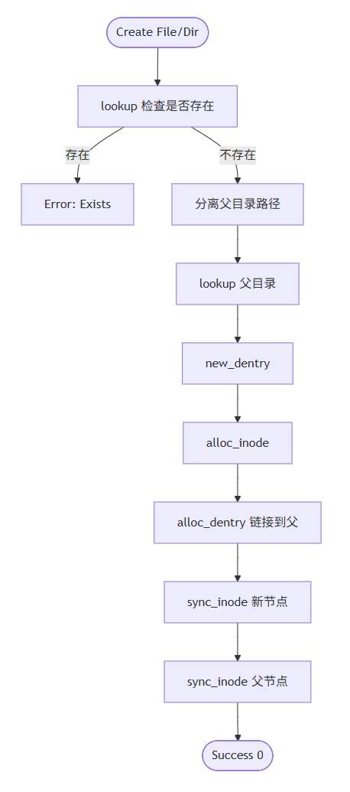
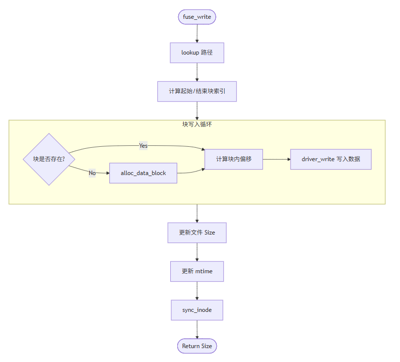
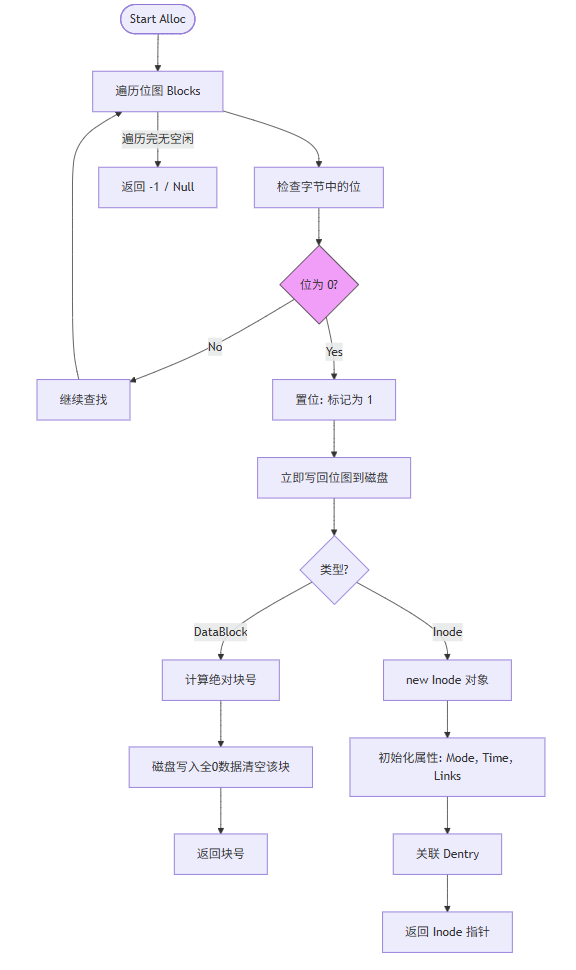
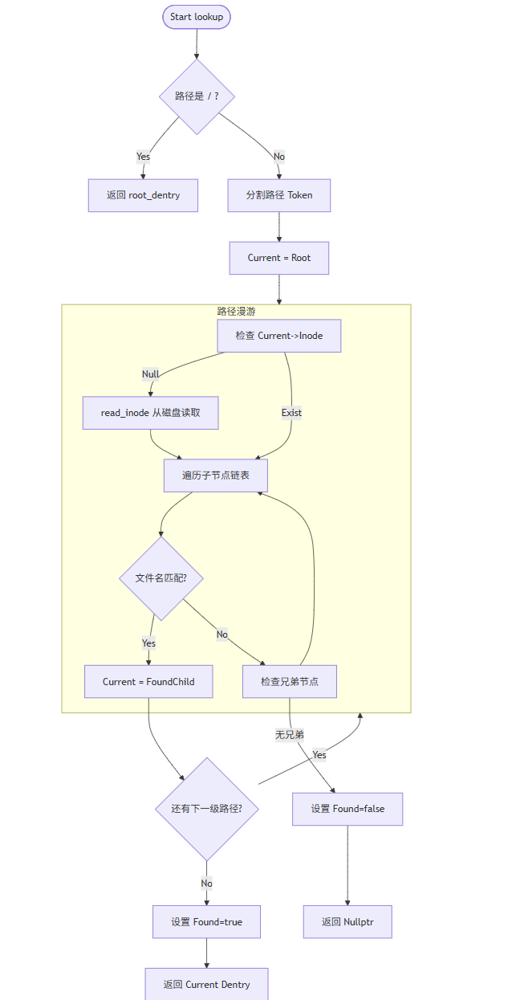
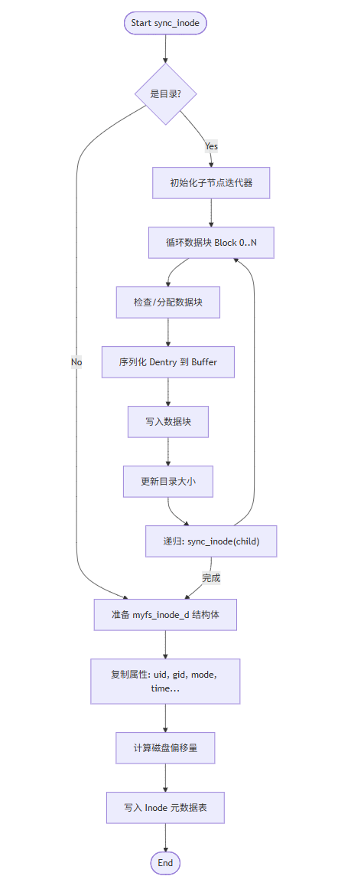

# 基于 FUSE 的 EXT2 文件系统 (MyFS) - C++ 版

> 操作系统实验五
> 
> **时间**: 2025年9月

## 📖 项目简介

本项目实现了一个基于 FUSE (Filesystem in Userspace) 的简易 EXT2 文件系统。为了解决传统 C 语言开发中内存管理繁琐、字符串处理易错以及代码结构混乱的问题，本项目在实验过程中将底层实现从 C 语言全面重构为 **Modern C++ (C++17)**。

系统支持标准的文件操作，包括创建文件/目录、读写数据、硬链接、重命名、截断文件以及权限管理等。

---

## 🚀 C++ 重构

本项目的一大亮点是放弃了传统的 C 语言实现，转而采用 C++ 进行封装，主要改进如下：

1.  **内存安全 (RAII)**: 
    * 摒弃 `malloc`/`free`，全面采用 `std::vector<std::byte>` 管理磁盘块缓冲区。
    * 利用作用域规则自动释放内存，从根本上杜绝缓冲区溢出和内存泄漏。
2.  **优雅的字符串处理**:
    * 使用 `std::string` 和 `std::stringstream` 替代 `strtok`/`strcpy`。
    * 路径解析逻辑由几十行缩减为十几行，且更加安全。
3.  **面向对象架构 (OOP)**:
    * 构建 `FileSystem` 单例类，封装 `superblock`、`bitmap` 等核心数据。
    * 私有化核心数据，仅暴露必要接口，避免全局变量污染。
4.  **强类型安全**:
    * 使用 `std::byte` 清晰区分文本与二进制流。
    * 引入 `static_assert` 在编译期检查结构体对齐（Alignment），防止磁盘读写错位。

---

## 🏗️ 系统架构设计

系统运行在用户空间，通过 libfuse 库与内核交互。整体架构分为接口层、核心逻辑层和 IO 抽象层。

*(图：MyFS 总体架构设计，包含接口层、核心逻辑层与驱动层的交互)*

* **接口层 (`myfs.cpp`)**: 封装 `fuse_operations` 结构体，处理 FUSE 回调。
* **核心逻辑层 (`utils.cpp`)**: 
    * **FileSystem 单例**: 管理全局状态。
    * **路径解析**: `lookup` 模块。
    * **资源管理**: Inode 与 Dentry 管理，Bitmap 空间分配。
* **IO 抽象层**: 
    * **Driver Adapter**: 处理扇区读写适配。
    * **512B 对齐缓冲 (RMW)**: 处理非对齐读写，保证数据完整性。
    * **虚拟磁盘**: 底层操作 `Image` 文件。

---

## 🔄 核心逻辑流程

### 1. 系统初始化与挂载 (Mount)
系统启动时读取 SuperBlock，校验 Magic Number。若校验失败则自动格式化，否则加载元数据到内存。

### 2. 文件/目录创建 (Create/Mkdir)
通过 `lookup` 检查路径，分配新的 Inode 和 Dentry，并链接到父目录。

### 3. 数据写入 (Write)
包含底层的 Read-Modify-Write (RMW) 机制，处理块对齐，并自动分配新数据块。

### 4. 资源分配 (Alloc)
扫描 Bitmap 寻找空闲位，置位后立即刷盘，并在内存中构建对象。

### 5. 路径查找 (Lookup)
使用 `stringstream` 分割路径，逐级遍历目录项，支持延迟加载 Inode。

### 6. 数据同步 (Sync)
将内存中的 Dentry 序列化写入数据块，并将 Inode 元数据持久化到磁盘。

*(注：更多详细流程图请参阅实验报告)*

---

## 🛠️ 遇到的挑战与解决方案

### 1. 结构体对齐与磁盘错位
* **问题**: 编译器对结构体自动填充导致 `sizeof` 大小与设计不符（如 Inode 应为 128 字节），导致读写错位。
* **解决**: 使用 C++ `static_assert` 进行编译期检查，并调整结构体布局。

### 2. 混合编译链接错误
* **问题**: C++ 重构后，链接底层 C 语言驱动 (`ddriver.c`) 和 FUSE 库时出现 `undefined reference`。
* **解决**: 使用 `extern "C" {...}` 包裹 C 头文件，并重写 `CMakeLists.txt` 确保链接器行为正确。

### 3. 复杂的路径解析
* **问题**: C 语言处理多级目录（如 `/a/b/c`）代码冗长且易内存泄漏。
* **解决**: 利用 `std::getline(ss, token, '/')` 实现流式分割。

---

